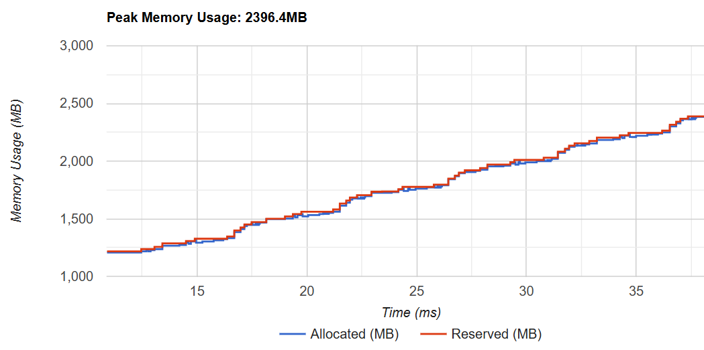
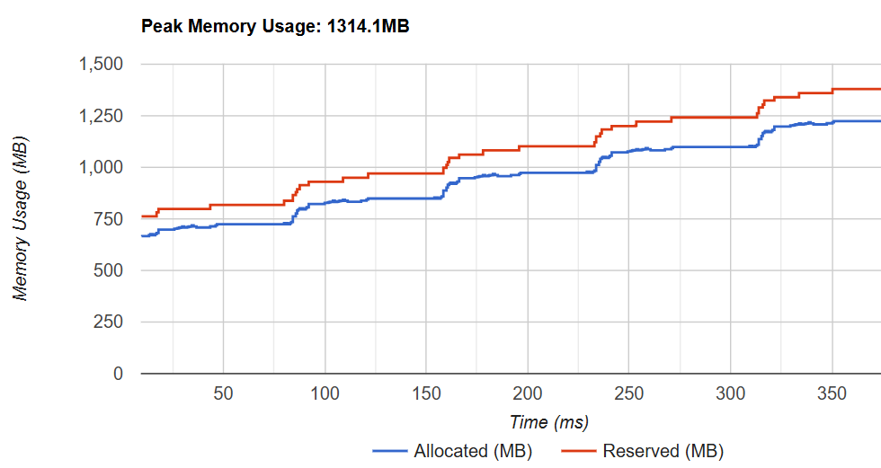

# Nested Tensors for Transformers

This project aims to implement a complete forward pass for the LLAMA model using [NestedTensors](https://pytorch.org/docs/stable/nested.html) in PyTorch. NestedTensors offer a more efficient approach to managing variable-length data, enhancing memory usage - a critical factor for large-scale inference and fine-tuning. The implementation leveraged the IBM [Foundation Model Stack (FMS)](https://github.com/foundation-model-stack/foundation-model-stack) to assess the impact of these optimizations, with the experiments conducted on standard GPUs (Nvidia L4).

FMS PR: [https://github.com/foundation-model-stack/foundation-model-stack/pull/370](https://github.com/foundation-model-stack/foundation-model-stack/pull/370)

## Setup

1. Create a virtual environment and activate it

   ```bash
   python -m venv venv
   source venv/bin/activate
   ```

1. In the root directory, clone the FMS repository, switch to the PR branch, and install the package in editable mode.

   ```bash
   git clone https://github.com/foundation-model-stack/foundation-model-stack.git
   ```

   ```bash
   cd foundation-model-stack
   git fetch origin pull/370/head:pr-370
   git checkout pr-370
   ```

   ```bash
   pip install -e .
   ```

1. Clone this repository in the root directory.

   ```bash
   cd .. # Navigate to the root directory
   git clone https://github.com/kushaangowda/nestedtensors-for-transformers.git
   ```

1. Install the dependencies.

   ```bash
   cd nestedtensors-for-transformers
   pip install -r requirements.txt
   ```

1. To reproduce our results:
   ```bash
   bash exec.sh
   ```

## Running Experiments with Different Configurations

To run experiments with custom configurations, you can modify the parameters in the `exec.sh` script. The `main.py` file, which handles the experiment execution, accepts the following command-line arguments:

- `--num_samples`: Specifies the number of data points to use.
- `--batch_size`: Sets the batch size for processing.
- `--device`: Specifies the device to run on (e.g., `cuda` for GPUs).
- `--num_workers`: Defines the number of workers for data loading.
- `--use_warmup`: Enables a warmup run by performing inference once before profiling.
- `--use_nested`: Enables the use of nested tensors. Omit this flag to use padded tensors instead.
- `--use_torch_profiler`: Activates the PyTorch profiler to track GPU usage and other performance metrics.

## Additional Profiling

To profile specific sections of the FMS code (e.g., the attention mechanism), follow these steps:

1. Add `hpml_utils` to the Python Path

   ```bash
   export PYTHONPATH="/path/to/nestedtensors-for-transformers/hpml_utils:$PYTHONPATH"
   source ~/.bashrc
   ```

   Replace `/path/to/nestedtensors-for-transformers` with the actual path of the repository.

2. Insert Profiling Code in FMS \
   Navigate to the FMS file where you want to enable profiling and insert the following code:

   ```python
   from hpml_utils.utils.profiler import profiler

   ...

   profiler.start("Attention Mechanism")
   # x = Attention(x)
   profiler.stop("Attention Mechanism")
   ```

The profiling time plot will automatically be included in the final output.

## Structure of this Repository

- `main.py` \
  Manages the entire experiment pipeline, including data creation and inference execution.

- `eval.py` \
  Processes the generated output tensors and evaluates them against specified tolerance thresholds.

- `time_profiling.py` \
  Utilizes time data produced by `main.py` to generate visualizations and performance graphs.

- `hpml_utils/` \
  Contains utility modules for time profiling and Torch-specific functions. These utilities facilitate the handling of nested tensors in FMS.

## Output Directories

The following directories will be generated once the script is executed:

- `data/`  
   This directory stores all calculated profiling times and the output tensors.

- `plots/`  
   Contains the plots generated for different profiling stages.

- `log/`  
   Stores logs if PyTorch profiling is enabled. You can visualize these logs using TensorBoard by running the following command:
  ```bash
  tensorboard --logdir=./log
  ```

## Findings

1. Inference Time


2. GPU Usage \
   Padded (Top) v/s Nested (Bottom)




3. Output Distribution


A detailed analysis is available in the [report](./report.pdf).

## Team Members

- [Kushaan Gowda](https://github.com/kushaangowda)
- [Harsh Benahalkar](https://github.com/benahalkar)
- [Siddarth Ijju](https://github.com/sidijju)
